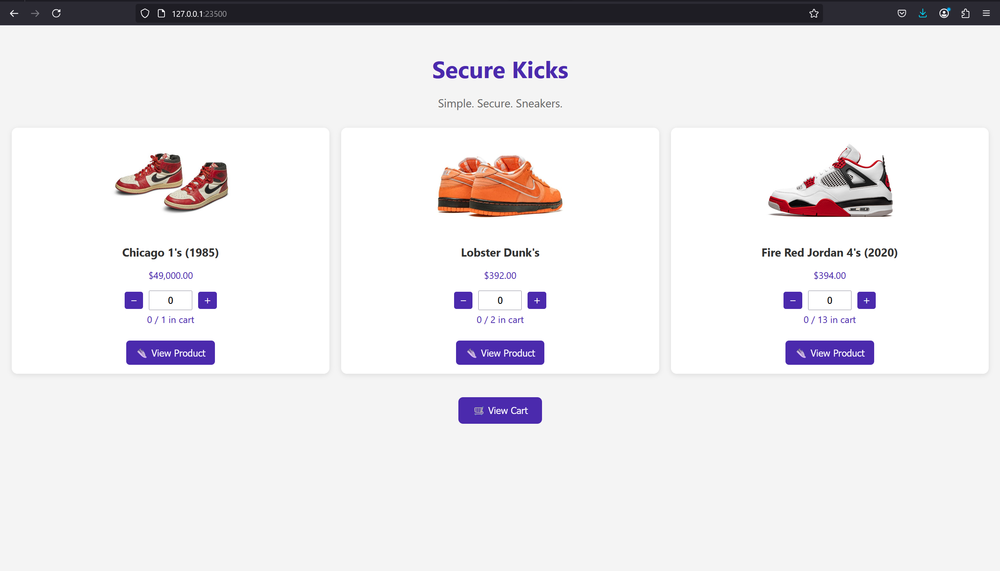

# Sneaker Shop Custom Web Server


Basic C++ web server written in C++ using CROW header library 


## Project Overview <a name="project-overview"></a>




### Key Features
- **High-Performance C++ Web Server**:
Leverage the power of C++ and the CROW library to deliver fast, lightweight, and reliable web services.

- **Dynamic Sneaker Web Store**:
Efficiently manage and display a complete sneaker inventory with detailed product descriptions, pricing, and stock levels.

- **Seamless Cart & Checkout Integration**:
Enjoy a smooth shopping experience with real-time cart updates and secure checkout processes.

- **Responsive Front-End Interface**:
Built using modern HTML, CSS, and JavaScript, the web app store offers an engaging, intuitive user interface.

- **Docker-Enabled Deployment**:
Easily deploy and scale your application with containerization support, ensuring consistency across environments.


## Technology Stack <a name="technology-stack"></a>

[](https://isocpp.org)
[](https://developer.mozilla.org/en-US/docs/Web/HTML)
[](https://developer.mozilla.org/en-US/docs/Web/CSS)
[](https://developer.mozilla.org/en-US/docs/Web/JavaScript)
[](https://www.docker.com)  


**Dependencies**:
- CMake
- CROW


## Getting Started <a name="getting-started"></a>

1. ```bash 
    git clone https://github.com/Nathancecixx/CPP-Server
    ```
2. ```bash 
    mkdir build
    cd build
    ```

3. ```bash 
    cmake ..
    make
    ```

4. ```bash
    ./Webserver
    ```

## License
This project is licensed under the MIT License - [Full Text](LICENSE)

